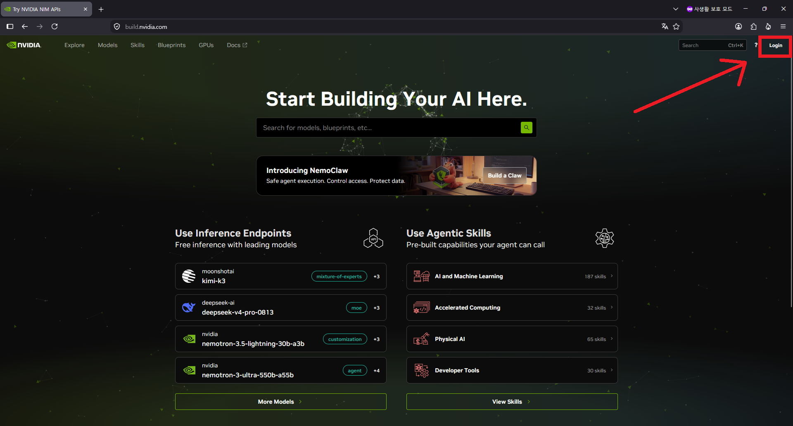
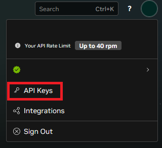
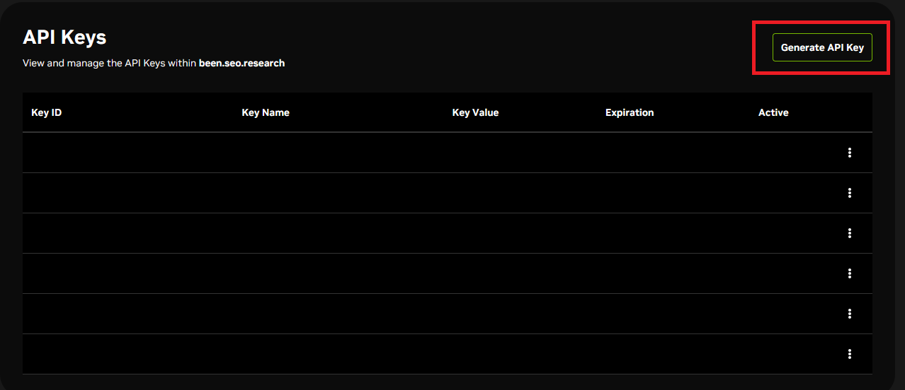
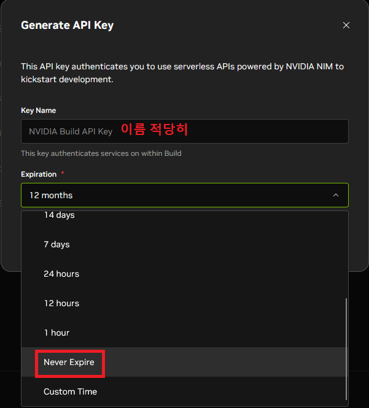
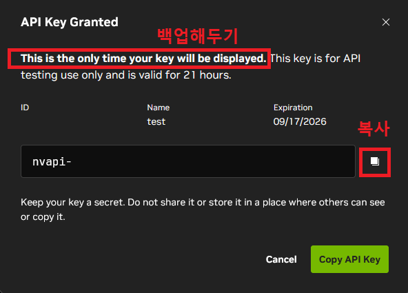
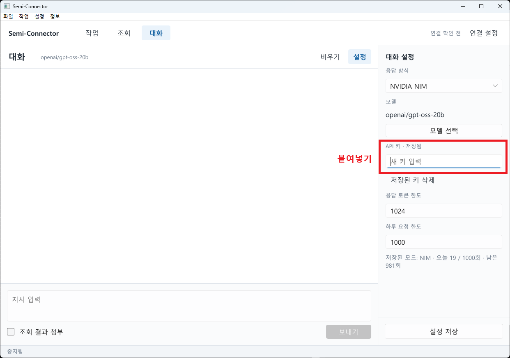

# Semi-Connector

마비노기 모바일 AI 커넥터용 비AI 툴
## 설치
[다운로드](https://github.com/teatray-top/Semi-Connector/releases)

## NVIDIA NIM API 활용 무료 AI

1. [NVIDIA API Catalog](https://build.nvidia.com/)에 회원가입 및 로그인.

   

2. 계정 메뉴에서 **API Keys**를 열기.

   

3. **Generate API Key**를 선택.

   

4. 키 이름과 만료 기간을 설정.

   

5. 한 번만 표시되는 키를 복사해 안전하게 보관.

   

6. Semi-Connector의 **대화 설정**에서 NVIDIA NIM을 선택하고 키를 저장.

   

NVIDIA 정책 상 40RPM이 적용됩니다. 
AI 기본 모델은 gpt-oss(20b)입니다. 원하시는 모델을 선택하시되,  모델 지원이 굉장히 유동적이므로 테스트 후 사용하시면 됩니다.
